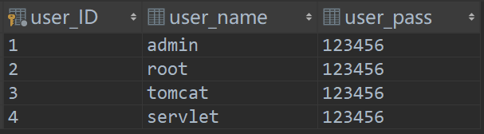

# Login接口文档

## 接口名称

**英文名称**：login

**url**：http://111.231.119.201:8080/wishesmap/login

## 接口含义

用户登录时，系统提取**用户名**和**密码**，与数据库数据进行比对，如果已经注册，返回用户**user_ID**；否则返回**-1**。


## 接收数据格式

json字符串，其格式为

```json
{
	"user_name":xxx,
	"user_pass":xxx
}
```

换行与空格对结果无影响

## 返回数据格式

（从postman复制的）

```json
{"user_ID":3}
```

## 接口测试用例及结果

**后台未检测json数据格式的正确性！！！**如**{"user_ID":3**，没有}会抛异常。



| 用例ID |                     发送数据                      |  预期返回数据  |  实际返回数据  |
| :----: | :-----------------------------------------------: | :------------: | :------------: |
|   1    | {"user_name":"tomcat",<br />"user_pass":"123456"} | {"user_ID":3}  | {"user_ID":3}  |
|   2    | {"user_name":"tomcat",<br />"user_pass":"12346"}  | {"user_ID":-1} | {"user_ID":-1} |
|   3    |  {"user_name":"admi",<br />"user_pass":"123456"}  | {"user_ID":-1} | {"user_ID":-1} |


